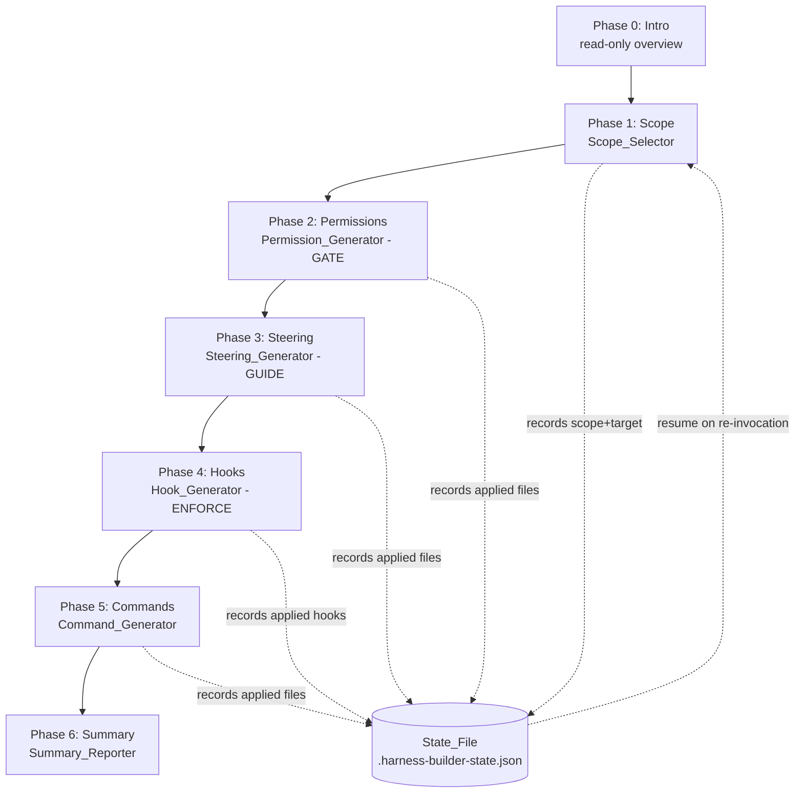
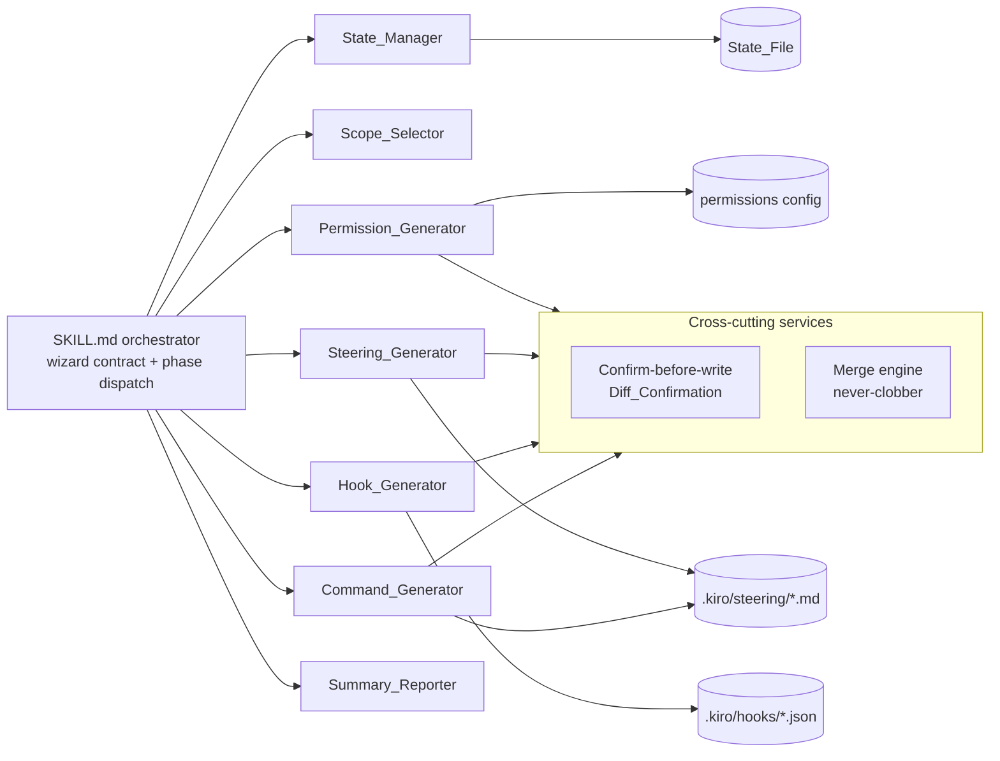

# Design Document

## Overview

`kiro-harness-builder` is an interactive, confirm-before-write wizard that installs a project **harness** built from Kiro's three native enforcement layers — **steering** (guide), **capability-based permissions** (gate), and **agent hooks** (enforce) — rather than from prompt text alone. It is a port of the existing `claude-harness-builder` skill from Claude Code's mechanisms to Kiro's mechanisms, preserving the source project's philosophy that *guardrails should be enforced by structure, not by hope*.

This document specifies both:

1. **What the wizard produces** — the harness artifacts written into a target project (steering files, permission rules, hooks, manual-inclusion commands) and how they are generated, merged, and verified.
2. **What the wizard itself is** — a **Kiro Skill** (`SKILL.md` orchestrator + `references/` per-phase playbooks + `templates/` artifact templates) that ships in this repository, mirroring the source project's skill structure.

### Packaging decision (confirmed)

The wizard ships **as a Kiro Skill plus supporting reference and template files**, not as a runtime service or compiled program. The "components" named in the requirements Glossary (`Scope_Selector`, `Permission_Generator`, etc.) are **logical roles executed by the Kiro agent as it follows `SKILL.md` and the phase playbooks** — they are documentation-defined behaviors, not deployed code modules. The wizard's only executable outputs are the shell scripts embedded in generated **command-action hooks**; the wizard's own logic is agent-driven Markdown. This mirrors `claude-harness-builder`, where the "wizard" is a `SKILL.md` orchestrator that drives `AskUserQuestion` flows and file writes.

### Concept mapping: Claude Code → Kiro

The port is a one-to-one remap of mechanisms. Every source concept has a Kiro-native equivalent:

| claude-harness-builder (source) | kiro-harness-builder (this design) |
|---|---|
| `CLAUDE.md` rules (guide layer) | **Steering files** `.kiro/steering/*.md` with `always` / `fileMatch` / `manual` inclusion modes |
| Custom slash commands `.claude/commands/*.md` | **Manual-inclusion steering files** (`inclusion: manual`), invoked on demand as slash commands |
| `settings.json` permissions (`allow`/`ask`/`deny`) | **Kiro capability-based permission rules** — per-capability match patterns with `deny`/`ask`/`allow` effects, restrictive-wins |
| Claude Code hooks (`.sh` + `settings.json` `hooks` block) | **Kiro agent hooks** — versioned JSON in `.kiro/hooks/*.json`, `command` or `agent` actions |
| 7 hook events incl. `PermissionRequest`, `SessionEnd` | Kiro Hook_Trigger set (10 triggers); `PermissionRequest` is absorbed by the permissions layer, `SessionEnd` has no Kiro equivalent (see Open Assumptions) |
| `${CLAUDE_PROJECT_DIR}` path variable | `${KIRO_PROJECT_DIR}` project-directory variable with `$PWD` fallback (see Open Assumptions) |
| `.claude/.harness-builder-state.json` | `.harness-builder-state.json` State_File under the chosen scope's `.kiro/` directory |
| `disableAllHooks` + `HARNESS_DISABLE_*` kill switches | Per-hook `HARNESS_DISABLE_<HOOK_NAME>` kill switches (unchanged) |

### Design goals

- **Structure over hope** — anything that *must* hold becomes a permission `deny` rule and/or an enforcement hook, never steering text alone.
- **Confirm before every write** — no file is created or modified without first showing exact content/diff and receiving explicit `Apply`.
- **Merge, never clobber** — existing Kiro configuration is preserved byte-for-byte outside marked regions.
- **Resumable** — progress is persisted so an interrupted or context-compacted run resumes without repeating writes.
- **Fail safe** — generated convenience hooks fail open; generated enforcement hooks fail closed (never silently allow).

## Research Summary

Key findings that inform this design (Kiro documentation; content rephrased for compliance with licensing restrictions):

- **Hooks** are standalone versioned JSON files at `.kiro/hooks/*.json`. A hook file has a top-level `version` and a `hooks` array; each entry has `name`, `trigger`, an optional `matcher` (regex), an `action` (`type` `command` or `agent`), and optional `timeout`/`enabled`. Hooks receive event context as JSON on STDIN and communicate results via exit codes and STDOUT JSON. This is the same schema used by the local `createHook` tooling. Sources: [Hooks](https://kiro.dev/docs/hooks/), [What's new in 1.0 — hooks](https://kiro.dev/docs/ide/whats-new-v1/hooks/), [CLI v3 migration guide](https://kiro.dev/docs/cli/v3/migration-guide/).
- **Hook exit semantics** (from the local runtime contract and [CLI 2.x reference](https://kiro.dev/docs/cli/2x-reference/)): exit `0` = success, STDOUT captured (forwarded as context for `SessionStart`/`UserPromptSubmit`/`PreToolUse`); exit `2` = block the action (`PreToolUse`, `UserPromptSubmit`, `PreTaskExec`), STDERR forwarded; any other code = non-blocking failure. For `PreToolUse`, an exit-`0` STDOUT payload may carry a decision `{"hookSpecificOutput":{"permissionDecision":"ask"|"allow"|"deny","permissionDecisionReason":"..."}}`; `permissionDecision: "ask"` prompts the user to confirm.
- **Matchers** are tested against the tool name for `PreToolUse`/`PostToolUse` and against the file path for `PostFileCreate`/`PostFileSave`/`PostFileDelete`; for other triggers the matcher is ignored.
- **Permissions** are capability-based: per-capability declarative rules pairing a match pattern with an explicit effect (`deny`/`ask`/`allow`). The most restrictive effect wins across scopes (`deny` > `ask` > `allow`) and cannot be loosened; nothing is silently allowed or denied. Scopes include workspace, agent, and session. Sources: [Permissions](https://kiro.dev/docs/permissions/), [Capability-based permissions](https://kiro.dev/docs/ide/whats-new-v1/permissions/), [Enterprise permission policies](https://kiro.dev/docs/enterprise/governance/permissions/).
- **Steering** files are Markdown at `.kiro/steering/*.md` giving Kiro persistent project knowledge; front-matter selects an inclusion mode — `always`, `fileMatch` (glob-triggered), or `manual` (on-demand, usable as a slash command). Sources: [Steering](https://kiro.dev/docs/steering/), [New features in 3.0](https://kiro.dev/docs/cli/v3/new-features/).

## Architecture

### Runtime model

The wizard runs **in the main Kiro agent conversation**. The agent loads `SKILL.md`, then progressively loads one `references/*.md` playbook as it enters each phase. User steering happens through single/multi-select questions (the `user_input` mechanism on Kiro Web). No phase is delegated to a subagent — interactive questions must run in the main conversation.

### The seven phases and the gate/guide/enforce ordering



The fixed order encodes three dependency relationships (surfaced to the user in Phase 0, per Requirement 2.3):

- **Scope precedes permissions** — every later write needs a resolved target directory; scope selection produces it.
- **Permissions precede hooks** — permission `deny` rules are the hard wall that best-effort hooks pair with; the gate must exist before the enforcement layer references it.
- **Steering precedes hooks** — steering guides the model *before* a hook must intervene; steering sections cross-reference the enforcement artifacts that back them, so the guide is authored first.

### Component / role map



Every component is a **role the agent performs by following a playbook**, not a deployed module. Two cross-cutting services — the **Diff_Confirmation flow** and the **merge engine** — are shared by all generators and defined once in the artifact-rules playbook.

## Components and Interfaces

The wizard skill is composed of one orchestrator plus per-phase playbooks. Each logical component below states its responsibility, the requirements it satisfies, its inputs/outputs, and the playbook that defines it.

### SKILL.md orchestrator (wizard contract + phase dispatch)

- **Responsibility:** Enforce the non-negotiable wizard contract (run in main conversation; progress header on every message identifying phase N of 7; never write without Diff_Confirmation; merge-never-clobber). Sequence the 7 phases in fixed order; validate jump requests; read the State_File and target files at the start of every phase (trust files over conversational memory, for compaction safety).
- **Satisfies:** Requirement 1 (all), Requirement 6.4–6.7 (resume dispatch).
- **Progress indicator:** `**🔧 Kiro Harness Builder — Phase <N>/6 (of 7): <PhaseName>**`; in Phase 4 append ` (hook <k>/<n>: <trigger>)`.
- **Jump handling:** A jump to phase 0–6 is honored, but Phase 1 (Scope) runs first if no scope is recorded (Req 1.5). A jump outside 0–6 is rejected with an error and no phase change (Req 1.6).

### Scope_Selector (Phase 1)

- **Responsibility:** Choose where the harness is installed and resolve the write target used by Phases 2–5.
- **Satisfies:** Requirement 3 (all).
- **Inputs:** user selection of `workspace` vs `user` scope.
- **Outputs:** State_File `scope` identifier + resolved absolute `targetRoot` path; creates the target directory if absent (Req 3.6).
- **Interface (conceptual):** `resolveScope(choice) -> {scopeId, targetRoot}` where `workspace -> <project>/.kiro/` and `user -> ~/.kiro/`.
- **Behavior notes:** Blocks advancement to Phase 2 until a scope is recorded (Req 3.5). On user-level scope, warns that hooks referencing workspace-relative paths will not apply to other projects (Req 3.8). If writing scope to the State_File fails, leaves the State_File unchanged and remains on Phase 1 (Req 3.4).

### Permission_Generator (Phase 2 — GATE)

- **Responsibility:** Produce Kiro capability-based Permission_Rules from presets and merge them into the scope's permission configuration.
- **Satisfies:** Requirement 7 (all), Requirement 5.4–5.6 (permission merge).
- **Presets offered (each shows the capabilities it maps to and the effect):**
  - **Deny secrets (Recommended)** — `deny` on `fs_read` and `fs_write` for secret/credential path patterns (`.env*`, `secrets/**`, `*.pem`, `id_rsa*`, `kubeconfig`) (Req 7.2).
  - **Deny destructive shell (Recommended)** — `deny` on `shell` for destructive operations: deleting/overwriting/relocating files or modifying system state outside the workspace (`rm -rf`, `git push --force`, `git reset --hard`, `sudo`, `curl|sh`) (Req 7.3).
  - **Ask before network** — `ask` on `web_fetch` and `sandbox_network` (Req 7.4).
  - **Allow common dev commands** — `allow` on `shell` for routine read-only/dev commands (status/diff/log, test, lint), with runner detected from the project's lockfiles/manifests.
- **Interface (conceptual):**
  - `generateRules(selectedPresets) -> PermissionRule[]` — requires ≥1 preset or returns an error preserving selection (Req 7.6); assigns each affected capability exactly one effect (Req 7.5).
  - `resolveConflicts(rules) -> PermissionRule[]` — when two rules target the same capability with different effects, keeps the single most restrictive (`deny` > `ask` > `allow`) (Req 7.7).
  - `mergePermissions(existing, new) -> config` — set union preserving all existing rules, adding only absent rules, no duplicates (Req 5.4).

### Steering_Generator (Phase 3 — GUIDE)

- **Responsibility:** Generate steering files (project-rule skeleton) under the scope's `steering` directory.
- **Satisfies:** Requirement 8 (all), Requirement 5.1–5.3 (steering marker merge).
- **Inputs:** user-selected steering sections (≥1 offered, each with name + one-line scope description).
- **Outputs:** exactly one steering file per selected section, with front-matter `inclusion` set to `always` (default), `fileMatch` (+ ≥1 glob when the section is file-type scoped), or `manual` (Req 8.5, 8.6).
- **Interface (conceptual):**
  - `generateSection(section, scope) -> SteeringFile`
  - `mergeSteering(existing, generated) -> content` — if no markers, append inside a matched begin/end marker pair; if markers exist, replace only between them, preserving all outside content (Req 5.2, 5.3). If the file already exists at the resolved path with no prior harness content, it is not overwritten and is reported skipped (Req 8.4).
- **Behavior notes:** Cross-references the paired Enforcement_Hook or Permission_Rule by name/path when a section corresponds to one (Req 8.7). Build/test-command guidance is derived only from a command string found in a project config/manifest; if no evidence is found, the guidance is omitted and the absence is recorded (Req 8.8, 8.9).

### Hook_Generator (Phase 4 — ENFORCE)

- **Responsibility:** Select Hook_Triggers and generate schema-conformant Kiro Hook_Definitions, including translating natural-language policies into hooks.
- **Satisfies:** Requirement 9 (all), Requirement 10 (all), Requirement 11 (all).
- **Stage A:** multi-select of supported Hook_Triggers (Glossary set). Zero selected → skip generation, mark phase complete, advance (Req 9.3).
- **Stage B:** process selected triggers sequentially in agentic-loop order (Req 9.2); for each, present its firing condition, blocking capability, and harness role, and offer 2–3 canned policies (Req 9.4). The automatic free-text option handles natural-language policies (Req 10.1).
- **Interface (conceptual):**
  - `generateHook(trigger, policy) -> HookDefinition` — conforms to the versioned hook JSON schema, stored under the scope's `.kiro/hooks/` (Req 9.5); action type `command` for shell actions, `agent` for prompt actions (Req 9.7, 9.8).
  - `generateFromNL(trigger, text) -> HookDefinition` — accepts 1–2000 char descriptions; rejects empty / >2000 / unmappable input with a reason (Req 10.1, 10.2). Always injects the `HARNESS_DISABLE_<HOOK_NAME>` kill switch (Req 10.3). Builds any externally-influenced JSON with a structured serializer (`jq`), never raw string interpolation (Req 10.6). Resolves project paths through `${KIRO_PROJECT_DIR}` with `$PWD` fallback (Req 10.7).
  - `proposePairedDeny(enforcementHook) -> PermissionRule` — for every Enforcement_Hook, propose a paired permission `deny` that enforces the same policy at the gate layer (Req 9.9).
  - `detectConflict(hook, existingArtifacts) -> Conflict?` — if a policy contradicts an existing Permission_Rule or Enforcement_Hook, report the specific artifact, withhold the write, and require explicit confirmation; decline → discard (Req 10.4, 10.5).
- **Safe-failure guarantees baked into generated hooks (Req 11):** convenience hooks fail open (non-blocking success exit within 5s when a dependency is missing); enforcement hooks fail closed (emit `ask` with a 1–500 char reason, never `allow`, when config can't be parsed); `Stop` hooks carry a re-entry guard and the generator refuses to emit a `Stop` hook that lacks one (Req 11.3, 11.4); a blocking enforcement hook signals the block via the documented blocking exit/decision with a non-empty reason (Req 11.5).

### Command_Generator (Phase 5)

- **Responsibility:** Generate manual-inclusion steering files that act as on-demand slash commands, from the user's own description.
- **Satisfies:** Requirement 12 (all).
- **Interface (conceptual):** `generateCommand(description) -> SteeringFile{inclusion: manual}` — accepts 1–2000 char non-empty descriptions; rejects empty / >2000 with an error and no write (Req 12.2, 12.3). Refuses to overwrite an existing same-named file, reporting a naming conflict (Req 12.4). Generates only from the user's submitted description; does not install teaching-example commands unless explicitly requested (Req 12.5). Records each written file in the State_File; on state-record failure, retains the file and leaves the State_File unchanged (Req 12.6, 12.7).

### Summary_Reporter (Phase 6)

- **Responsibility:** Report applied files, verification steps, kill switches, and rollback, then offer State_File cleanup.
- **Satisfies:** Requirement 13 (all).
- **Outputs:** a table of every created/merged file with its operation type from the State_File (or a "no files changed" message) (Req 13.1, 13.2); per-hook and per-preset verification steps (an executable instruction + expected observable result) (Req 13.3); the list of installed kill switches and how to disable each hook/all hooks (Req 13.4); per-file rollback instructions (restore for merged, removal for created), displayed as text and never executed (Req 13.5); a prompt to confirm State_File deletion, retained unless confirmed, with an error shown if deletion fails (Req 13.6, 13.7).

### State_Manager (cross-cutting)

- **Responsibility:** Persist and restore wizard progress for resume-after-interruption.
- **Satisfies:** Requirement 6 (all).
- **Interface (conceptual):** `recordPhase(phaseId, appliedPaths)`, `recordHookApplied(hookId)`, `load() -> State?`, `isApplied(pathOrHookId) -> bool`.
- **Behavior notes:** Records the completed phase + applied paths before the next phase begins, and each applied hook before applying the next (Req 6.1, 6.2). On a State_File write failure, halts the phase, reports the failure, and preserves already-applied files (Req 6.3). On invocation with a valid State_File, prompts resume-vs-restart (Req 6.4); no State_File → begin at Phase 1 (Req 6.5); unreadable/unparseable → treat progress as absent, warn, retain the file unchanged, begin at Phase 1 (Req 6.6). Re-running a completed phase skips already-applied artifacts unless the user chooses to reconfigure (Req 6.7, 6.8).

## Data Models

### State_File — `.harness-builder-state.json`

Written under the chosen scope's `.kiro/` directory (workspace: `<project>/.kiro/.harness-builder-state.json`; user: `~/.kiro/.harness-builder-state.json`).

```json
{
  "version": 1,
  "completedPhases": [0, 1, 2],
  "scope": "workspace",
  "targetRoot": "/abs/path/to/project/.kiro",
  "permissionsPath": "/abs/path/to/project/.kiro/settings/permissions.json",
  "selectedHooks": [
    { "trigger": "PreToolUse", "hookId": "deny-secrets-guard", "done": true },
    { "trigger": "Stop", "hookId": "tests-must-pass", "done": false }
  ],
  "appliedFiles": [
    { "path": "/abs/.kiro/settings/permissions.json", "action": "merged" },
    { "path": "/abs/.kiro/steering/project-rules.md", "action": "created" }
  ]
}
```

- `action` is one of `created` | `merged`.
- The whole file is rewritten after each completed phase and after each applied hook in Phase 4.
- `permissionsPath` is the resolved permission-config location for the scope (see Open Assumptions #2).

### Permission_Rule

A declarative rule pairing a Kiro Capability + match pattern with an effect. Conceptual shape (exact serialization depends on the confirmed permission-config format — Open Assumptions #2):

```json
{ "capability": "fs_read", "pattern": "**/.env*", "effect": "deny" }
```

- `capability` ∈ { `fs_read`, `fs_write`, `shell`, `web_fetch`, `web_search`, `mcp`, `subagent`, `skill`, `power`, `context`, `diagnostics`, `sandbox_network`, meta: `all`/`builtin`/`filesystem` }.
- `effect` ∈ { `deny`, `ask`, `allow` }; restrictive-wins ordering `deny` > `ask` > `allow`.

### Hook_Definition — `.kiro/hooks/*.json`

Confirmed Kiro versioned schema:

```json
{
  "version": "v1",
  "hooks": [
    {
      "name": "deny-secrets-guard",
      "trigger": "PreToolUse",
      "matcher": "fs_write|fs_read|shell",
      "action": {
        "type": "command",
        "command": "\"${KIRO_PROJECT_DIR}\"/.kiro/hooks/scripts/deny-secrets-guard.sh"
      },
      "timeout": 10,
      "enabled": true
    }
  ]
}
```

- `trigger` ∈ the Glossary Hook_Trigger set (10 triggers).
- `matcher` is an optional regex: tested against the **tool name** for `PreToolUse`/`PostToolUse`, against the **file path** for `PostFileCreate`/`PostFileSave`/`PostFileDelete`, ignored otherwise.
- `action.type` is `command` (shell command; may reference a script under `.kiro/hooks/scripts/`) or `agent` (static prompt appended to context).
- Multiple hooks may co-exist in one file's `hooks` array; the merge engine appends by `name` and never removes an existing entry.

### Steering file — `.kiro/steering/<name>.md`

```markdown
---
inclusion: fileMatch
fileMatchPattern: "**/*.ts"
---

<!-- harness-builder:begin (generated by kiro-harness-builder — edits inside this block may be overwritten on re-run) -->
## <Section title>
...generated guidance...
Enforced by: `.kiro/hooks/deny-secrets-guard.json` and permission deny rule on `fs_write(**/.env*)`.
<!-- harness-builder:end -->
```

- `inclusion` ∈ { `always`, `fileMatch`, `manual` }; `fileMatch` carries ≥1 non-empty glob.
- Manual-inclusion files (Phase 5) omit `fileMatchPattern` and set `inclusion: manual`; they are invoked on demand as slash commands.
- Merge is marker-scoped: content outside the `harness-builder:begin`/`:end` markers is preserved byte-for-byte.

### Diff_Confirmation

A single-select approval prompt shown before any write, offering exactly three actions: **Apply**, **Edit first**, **Skip**. `Edit first` loops (incorporate changes → re-present) without writing until `Apply` is chosen; `Skip` leaves the file unchanged and continues.


## Correctness Properties

*A property is a characteristic or behavior that should hold true across all valid executions of a system — essentially, a formal statement about what the system should do. Properties serve as the bridge between human-readable specifications and machine-verifiable correctness guarantees.*

These properties target the wizard's **pure-logic units** — the phase controller, scope/path resolution, the permission merge and restrictive-effect resolver, the marker-scoped steering merge, state resume/idempotence, input validation, the hook-schema mapper, and the generated-artifact structural guards. Interactive presentation and content-completeness criteria are covered by example/integration tests in the Testing Strategy instead. Properties were consolidated per the prework Property Reflection to remove redundancy.

### Property 1: Phase sequencing follows the fixed order

*For any* sequence of phase completions starting from a fresh run, the phases presented form the increasing prefix 0,1,2,3,4,5,6 with each non-final phase's confirmed completion yielding exactly the next phase, and completing phase 6 yields no further phase.

**Validates: Requirements 1.1, 1.2, 1.3, 1.7**

### Property 2: Jump routing is validated and scope-gated

*For any* requested jump target, if the target is in 0–6 the wizard routes to it except that Phase 1 (Scope) runs first whenever no scope is recorded, and if the target is outside 0–6 the wizard rejects it and leaves the current phase unchanged.

**Validates: Requirements 1.5, 1.6**

### Property 3: Progress header identifies phase and total

*For any* phase number p in 0–6, the rendered progress header contains p and the total phase count 7.

**Validates: Requirements 1.4**

### Property 4: Phase 0 enumerates the exact Hook_Trigger set

*For any* rendering of Phase 0, the set of Hook_Trigger events enumerated equals the canonical Glossary trigger set exactly — no omissions and no extras.

**Validates: Requirements 2.2**

### Property 5: Phase 0 performs no file mutations

*For any* input processed while Phase 0 is active, the set of file create/modify/delete operations performed is empty.

**Validates: Requirements 2.4**

### Property 6: Scope resolution maps to the correct .kiro root

*For any* scope selection, the resolved target root is the project `.kiro/` directory for workspace scope and the user `~/.kiro/` directory for user scope, and this resolved absolute path plus the scope identifier are recorded in the State_File before Phase 1 completes.

**Validates: Requirements 3.1, 3.2, 3.3**

### Property 7: Target directory existence is ensured idempotently

*For any* resolved target path, after directory resolution the target directory exists, and applying the ensure-directory step to an already-existing directory leaves it unchanged.

**Validates: Requirements 3.6**

### Property 8: All later writes stay under the recorded scope root

*For any* artifact generated in Phases 2 through 5, its resolved write path is located under the target root recorded in the State_File.

**Validates: Requirements 3.7**

### Property 9: A file is written if and only if Apply was chosen for it

*For any* sequence of Diff_Confirmation resolutions, a target file is created or modified exactly when its confirmation resolved to Apply, and no file is written for a confirmation resolved to Skip or still in an Edit-first loop.

**Validates: Requirements 4.3, 4.5**

### Property 10: Every write is preceded by a content/diff display offering exactly three actions

*For any* create or modify operation, a content display (full content for creates, a diff for modifications) is emitted before the write, and every Diff_Confirmation presents exactly the three actions Apply, Edit first, and Skip.

**Validates: Requirements 4.1, 4.2, 4.6**

### Property 11: Edit-first loops without writing

*For any* number of consecutive Edit-first selections on a pending write, no file is written and each iteration re-presents a Diff_Confirmation with the same three actions until Apply or Skip is chosen.

**Validates: Requirements 4.4**

### Property 12: Content outside harness markers is preserved across a merge

*For any* existing target file, merging harness content leaves every byte outside the harness-builder marker boundaries identical to its pre-merge state; when a marker pair already exists, only the content between the markers changes.

**Validates: Requirements 5.1, 5.3**

### Property 13: Marker-less steering merge appends exactly one matched marker pair

*For any* existing steering file containing no harness-builder markers, the merged result equals the original content followed by the generated content enclosed in exactly one matched begin/end marker pair.

**Validates: Requirements 5.2**

### Property 14: Permission merge is a deduplicated, order-preserving union and is idempotent

*For any* existing rule set and new rule set, the merged result retains every existing rule in order and appends only the new rules not already present with no duplicates; merging the same new rules a second time produces no further change.

**Validates: Requirements 5.4, 5.6**

### Property 15: Restrictive effect wins on capability conflicts

*For any* collection of effects assigned to a single capability, the resolved effect is the most restrictive one under the ordering deny > ask > allow, and the generated rule set assigns each capability exactly one effect.

**Validates: Requirements 7.5, 7.7**

### Property 16: Deny-secrets preset denies both read and write on secret patterns

*For any* secret/credential path pattern in the deny-secrets preset, the generated rules include a `deny` effect on both `fs_read` and `fs_write` for that pattern.

**Validates: Requirements 7.2**

### Property 17: Resume target is the first uncompleted phase

*For any* set of completed phases recorded in a valid State_File, the computed resume target is the lowest phase number not present in that set.

**Validates: Requirements 6.4**

### Property 18: Progress is recorded before advancing

*For any* completed phase, the State_File records that phase's identifier and its applied file paths before the next phase begins; within Phase 4, each applied hook's identifier is recorded before the next hook is applied.

**Validates: Requirements 6.1, 6.2**

### Property 19: Re-running a completed phase re-applies nothing already recorded

*For any* set of applied artifacts recorded in the State_File, re-running a completed phase produces no write for any file path or hook identifier already recorded as applied (absent an explicit reconfigure choice).

**Validates: Requirements 6.7**

### Property 20: Steering generation produces exactly one file per selected section

*For any* non-empty subset of steering sections the user selects, the generator produces exactly one steering file per selected section under the scope's steering directory.

**Validates: Requirements 8.2**

### Property 21: Generated steering files carry a valid inclusion mode

*For any* generated steering file, its `inclusion` value is exactly one of `always`, `fileMatch`, or `manual`, defaulting to `always` when the section specifies no mode; and any file-type-scoped section produces `inclusion: fileMatch` with at least one non-empty glob pattern.

**Validates: Requirements 8.5, 8.6**

### Property 22: Enforcement-paired steering sections cross-reference their enforcement artifact

*For any* steering section that corresponds to an Enforcement_Hook or Permission_Rule, the generated file content contains that paired artifact's name or path.

**Validates: Requirements 8.7**

### Property 23: Emitted command guidance traces to real manifest evidence

*For any* build-command or test-command guidance emitted in a steering file, the referenced command string appears in some configuration or manifest file within the target project.

**Validates: Requirements 8.8**

### Property 24: Hook trigger processing order is the canonical order restricted to the selection

*For any* subset of Hook_Triggers selected, the triggers are processed sequentially in the canonical agentic-loop order restricted to the selected subset, and the presented multi-select options equal the canonical Hook_Trigger set.

**Validates: Requirements 9.1, 9.2**

### Property 25: Generated hooks are schema-conformant and correctly located

*For any* (trigger, policy) pair, the generated Hook_Definition validates against the versioned Kiro hook JSON schema and is stored under the scope's `.kiro/hooks/` directory.

**Validates: Requirements 9.5**

### Property 26: Action type matches the action kind

*For any* generated hook, its `action.type` is `command` when the action is a shell command and `agent` when the action is an agent prompt.

**Validates: Requirements 9.7, 9.8**

### Property 27: Every enforcement hook proposes a paired permission deny

*For any* generated Enforcement_Hook, the generator proposes a paired Permission_Rule that enforces the same policy at the gate layer.

**Validates: Requirements 9.9**

### Property 28: Natural-language policy validation accepts valid input and rejects invalid input

*For any* natural-language policy description: if it is non-empty, at most 2000 characters, and maps to a supported Hook_Trigger, the generator produces a Hook_Definition and presents it for review before any write; otherwise (empty, over 2000 characters, or unmappable) it rejects the request with a reason and produces no Hook_Definition.

**Validates: Requirements 10.1, 10.2**

### Property 29: Generated hooks carry a correctly named kill switch

*For any* generated hook, its script contains a kill-switch guard named `HARNESS_DISABLE_<HOOK_NAME>`, where `<HOOK_NAME>` is the uppercased hook name, that causes the hook to exit without performing its action when the variable is set to a non-empty value.

**Validates: Requirements 10.3**

### Property 30: Generated command hooks assemble JSON structurally

*For any* generated command-action hook that emits JSON from externally influenced input, all JSON is assembled through a structured serializer (`jq` typed arguments) and no JSON is built by raw string interpolation of that input.

**Validates: Requirements 10.6**

### Property 31: Generated hook paths route through the project-dir variable with a cwd fallback

*For any* generated hook that references project paths, each path is resolved through the project-directory variable `${KIRO_PROJECT_DIR}`, and when that variable is unset or empty the path resolves relative to the current working directory.

**Validates: Requirements 10.7**

### Property 32: Convenience hooks fail open on missing dependencies

*For any* generated Convenience_Hook, when a required dependency is unavailable the hook terminates with the runtime's non-blocking success signal and does not alter the triggering action.

**Validates: Requirements 11.1**

### Property 33: Enforcement hooks fail closed on unusable configuration

*For any* generated Enforcement_Hook, when its policy configuration cannot be parsed or evaluated the hook emits an `ask` decision with a non-empty reason string of 1 to 500 characters and never emits an `allow` decision.

**Validates: Requirements 11.2**

### Property 34: Stop hooks are re-entry safe and are never generated without a guard

*For any* generated `Stop` hook, when it is invoked with the re-entry indicator set it terminates with the non-blocking success signal without gating the turn again; and the generator refuses to produce a `Stop` hook whose definition lacks a re-entry guard, writing no artifact and returning an error identifying the missing guard.

**Validates: Requirements 11.3, 11.4**

### Property 35: Enforcement blocks are signaled with a bounded reason

*For any* generated Enforcement_Hook that blocks an action, the hook signals the block via the runtime's documented blocking exit signal or blocking decision output and includes a non-empty reason string of 1 to 500 characters.

**Validates: Requirements 11.5**

### Property 36: Command description validation gates file generation

*For any* command description: if it is non-empty and at most 2000 characters, the Command_Generator produces exactly one steering file with `inclusion: manual` under the scope's steering directory; if it is empty or exceeds 2000 characters, it rejects the request with an error and creates no file.

**Validates: Requirements 12.2, 12.3**

### Property 37: Written command files are recorded in the State_File

*For any* command file successfully written, an entry for that file appears in the State_File `appliedFiles`.

**Validates: Requirements 12.6**

### Property 38: The summary report is complete over applied artifacts

*For any* recorded set of applied files and installed hooks/presets, the Phase 6 report contains: one table row per applied file with its path and operation type; one verification step (executable instruction plus expected observable result) per hook and per applied preset; one kill-switch entry per installed hook; and one rollback instruction per applied file (restore for merged, removal for created), with all rollback instructions emitted as text and never executed.

**Validates: Requirements 13.1, 13.3, 13.4, 13.5**


## Error Handling

The wizard's error strategy is built on two principles: **atomicity** (a failed operation leaves the target byte-for-byte unchanged) and **fail-safe defaults** (ambiguity resolves toward the safer outcome — never a silent allow, never a lost file).

| Failure | Detection | Behavior | Requirement |
|---|---|---|---|
| Scope write to State_File fails | State write returns error | Leave State_File unchanged; error; stay on Phase 1 | 3.4 |
| Advance attempted with no scope | Scope unset in state | Block advancement; message that scope is required | 3.5 |
| Write attempted during Phase 0 | Read-only phase guard | Block the operation; workspace unchanged; read-only message | 2.5 |
| File write fails after Apply | Write returns error | Leave target unchanged; error that write did not complete; continue | 4.7 |
| Target config is invalid JSON | Parse before merge | Leave file byte-for-byte unchanged; return error naming file + parse failure | 5.5 |
| State_File write fails mid-phase | State write returns error | Halt phase; error that progress could not be saved; preserve already-applied files | 6.3 |
| State_File unreadable/unparseable at start | Load + parse | Treat progress as absent; warn; retain the file unchanged; begin at Phase 1 | 6.6 |
| Zero presets at permission generation | Selection is empty | Produce no rules; error "select at least one"; preserve selection | 7.6 |
| Steering target file already exists | Path existence check | Do not overwrite; retain unchanged; report skipped | 8.4 |
| No build/test evidence in project | Manifest scan yields nothing | Omit command guidance; record that no evidence was found | 8.9 |
| Hook generation/store fails or def non-conformant | Schema validation + write result | Do not store; leave previously stored hooks unchanged; error describing the failure | 9.6 |
| NL policy empty / >2000 / unmappable | Length + mapping check | Reject with reason; generate nothing | 10.2 |
| Policy conflicts with existing artifact | Conflict detection vs recorded rules/hooks | Report the specific conflicting artifact; withhold the write; require explicit confirmation; discard on decline | 10.4, 10.5 |
| Generated Stop hook lacks re-entry guard | Pre-write guard check | Refuse; error identifying the missing guard; write no artifact | 11.4 |
| Command description empty / >2000 | Length check | Reject; create no file; error empty/too-long | 12.3 |
| Command file name collision | Path existence check | Do not overwrite; error naming conflict | 12.4 |
| State-record fails after command write | State write result | Retain the command file; error state-record failure; leave State_File at prior valid content | 12.7 |
| State_File deletion fails after confirm | Delete result | Error that deletion failed; retain State_File | 13.7 |

**Generated-hook runtime failures** are governed by the fail-open/fail-closed split (Requirement 11): convenience hooks (`SessionStart`, `UserPromptSubmit` non-blocking variants, `PostToolUse`, `PostFileCreate/Save/Delete`) exit success on a missing dependency; enforcement hooks (`PreToolUse` guards, blocking `UserPromptSubmit`, `Stop` gates) emit `ask` with a bounded reason when their config is unusable, and never silently allow.

## Testing Strategy

### Dual approach

- **Property-based tests** verify the universal properties in the Correctness Properties section across randomized inputs — the wizard's pure-logic units (phase controller, path resolution, permission merge + restrictive-effect resolver, marker-scoped steering merge, state resume/idempotence, input validators, hook-schema mapper, kill-switch naming, generated-script structural guards).
- **Unit / example tests** cover specific presets, catalog content, and boundary values (empty description, exactly 2000 vs 2001 characters, exactly-once markers).
- **Integration / snapshot tests** cover the pieces PBT does not fit: interactive presentation completeness (Phase 0 layer/ordering copy, preset catalog rendering, per-trigger explanations), whole-file generation snapshots for steering/hook artifacts, and end-to-end resume-after-interruption walkthroughs.

The wizard ships as a Kiro Skill (Markdown + shell-script templates), so the natural test target is a **thin reference implementation of the pure-logic units** (in a language with a mature PBT library) plus **shellcheck + BATS** tests over the generated hook scripts and a **JSON-schema validator** over generated hook definitions.

### PBT applicability assessment

PBT **applies** to this feature: the merge algorithms, effect resolution, path/scope resolution, validators, and schema mapping are pure functions with large input spaces and clear universal properties (union/dedupe, idempotence, restrictive-wins, preservation, round-trip-style marker preservation). PBT **does not apply** to the interactive presentation, the static intro copy, or the actual Kiro runtime's hook-dispatch behavior — those use example, snapshot, and integration tests respectively. Criteria classified EXAMPLE/EDGE_CASE/INTEGRATION in the prework are intentionally excluded from the property set.

### Property test configuration

- Use an established property-based testing library for the chosen implementation language (e.g. Hypothesis for Python, fast-check for TypeScript, proptest for Rust) — do not hand-roll property testing.
- Run a minimum of **100 iterations** per property test.
- Tag each property test with a comment referencing its design property, in the format:
  **Feature: kiro-harness-builder, Property {number}: {property_text}**
- Implement each correctness property with a **single** property-based test.

### Generated-artifact verification

- **Static structural checks** over generated hook scripts (covering Properties 29–35): kill-switch guard present and correctly named; `${KIRO_PROJECT_DIR:-$PWD}` fallback present; all JSON assembled via `jq` typed args (no interpolated JSON); enforcement scripts emit `ask` (never `allow`) on unusable config; `Stop` scripts contain the re-entry guard. Run these over randomized policy inputs.
- **Schema validation** of every generated `.kiro/hooks/*.json` against the versioned Kiro hook schema (Property 25).
- **`shellcheck`** on every generated shell script; **BATS** harness feeding crafted STDIN JSON to exercise deny/ask/allow/no-op exit paths.

## Artifacts

### Files the wizard produces in a target project

Under the scope root chosen in Phase 1 (`<project>/.kiro/` for workspace scope, `~/.kiro/` for user scope):

```
<scope>/.kiro/
├── settings/permissions.json          # merged capability permission rules (location per Open Assumption #2)
├── steering/
│   ├── <section>.md                    # generated steering (always / fileMatch), harness-marker block
│   └── <command-name>.md               # Phase 5 manual-inclusion steering = slash command
├── hooks/
│   ├── <hook-name>.json                # versioned Kiro Hook_Definition(s)
│   └── scripts/
│       └── <hook-name>.sh              # command-action hook scripts (chmod +x)
└── .harness-builder-state.json         # wizard progress (offered for deletion in Phase 6)
```

Existing steering files, permission config, and hook files are **merged, never clobbered**; every write is gated by a Diff_Confirmation.

### Files that make up the wizard skill itself (this repository)

Mirroring the source `claude-harness-builder` skill structure, ported to Kiro:

```
kiro-harness-builder/
├── README.md                           # English docs
├── README_KO.md                        # Korean docs (optional parity)
├── <skill manifest>                    # Kiro Skill packaging/manifest (see Open Assumption #4)
└── skills/
    └── wizard/
        ├── SKILL.md                    # Orchestrator: wizard contract, state protocol, phase dispatch
        ├── references/                 # Per-phase playbooks, loaded on phase entry only
        │   ├── agentic-loop.md         # Phase 0: Kiro loop diagram + guide/gate/enforce layers + ordering rationale
        │   ├── phase-scope.md          # Phase 1: workspace vs user scope, target resolution
        │   ├── phase-permissions.md    # Phase 2: capability presets + restrictive-wins merge algorithm
        │   ├── phase-steering.md       # Phase 3: steering sections + inclusion modes + marker merge
        │   ├── phase-hooks.md          # Phase 4: trigger multi-select + per-hook loop protocol
        │   ├── hooks-catalog.md        # Kiro Hook_Trigger catalog: firing condition, blocking, role, canned policies, safe test, pitfalls
        │   ├── artifact-rules.md       # Kiro-adapted generation rules (kill switch, PROJ_DIR fallback, Stop guard, fail-open/closed, jq JSON, paired deny)
        │   └── phase-commands.md       # Phase 5: teach-by-example + generate manual-inclusion command from description
        └── templates/
            ├── hooks/
            │   ├── pretooluse-guard.sh         # enforcement guard (fail-closed) + rules json
            │   ├── pretooluse-rules.json       # declarative ruleset
            │   ├── posttooluse-audit.sh        # convenience audit (fail-open)
            │   ├── userpromptsubmit-trigger.sh # keyword/context injection (fail-open) / banned-word block
            │   ├── sessionstart-context.sh     # context injection (fail-open)
            │   ├── stop-gate.sh                # Stop gate with mandatory re-entry guard
            │   └── postfile-*.sh               # PostFileCreate/Save/Delete templates (e.g. format/lint/audit)
            ├── hook-definition.json.tmpl       # versioned Kiro hook JSON wrapper (name/trigger/matcher/action/timeout/enabled)
            └── steering/
                ├── steering-section.md.tmpl    # front-matter + harness-marker block skeleton
                └── manual-command.md.tmpl      # inclusion: manual command skeleton
```

The template set diverges from the source in three Kiro-specific ways: (1) hook artifacts are **JSON definitions plus companion scripts** rather than scripts registered in a settings block; (2) the `PermissionRequest`/`SessionEnd` templates are dropped and `PostFileCreate/Save/Delete` templates are added; (3) commands are **manual-inclusion steering files**, not a separate commands directory.

## Open Assumptions Requiring Confirmation

These are unresolved and encode reasonable defaults; they should be validated before or during implementation.

1. **Hook event set.** This design uses the Kiro-native Hook_Trigger set from the requirements Glossary: `SessionStart`, `UserPromptSubmit`, `PreToolUse`, `PostToolUse`, `Stop`, `PreTaskExec`, `PostTaskExec`, `PostFileCreate`, `PostFileSave`, `PostFileDelete`. Kiro has **no `PermissionRequest`** event (its concerns are absorbed by the capability-permissions gate layer, which is why Phase 2 precedes Phase 4) and **no `SessionEnd`** event (the source's cleanup/flush role has no direct Kiro equivalent; a `Stop`-based or out-of-band approach would be needed if that role is required). Confirmed against [Kiro hooks docs](https://kiro.dev/docs/hooks/) and the local hook tooling, but the canonical trigger list should be re-verified against the target Kiro version.

2. **Permission configuration location and format.** Kiro documents capability permissions as declarative per-capability rules with restrictive-wins semantics and scopes including workspace, agent, and session, with a workspace scope path that appears to be hashed (`.kiro/workspace-roots/<hash>/`) per [Capability-based permissions](https://kiro.dev/docs/ide/whats-new-v1/permissions/). This design assumes a stable, writable workspace-scope permission file (represented here as `<scope>/.kiro/settings/permissions.json`) and a `{capability, pattern, effect}` rule shape. **The exact on-disk path and serialization — especially the hashed `workspace-roots` directory and whether the permission store is directly editable on Kiro Web — must be verified**; if permissions are not file-editable at the assumed location, Phase 2 must target whatever configuration surface Kiro exposes.

3. **Hook JSON schema specifics.** The versioned schema used here — top-level `version: "v1"` and a `hooks` array of `{name, trigger, matcher?, action:{type: command|agent, command|prompt}, timeout?, enabled?}` — is taken from the local `createHook` tooling and corroborated by the [CLI v3 migration guide](https://kiro.dev/docs/cli/v3/migration-guide/) example. The precise matcher semantics (regex against tool name for `PreToolUse`/`PostToolUse`, against file path for `PostFile*`), the exact `PreToolUse` decision payload (`hookSpecificOutput.permissionDecision` = `allow`/`deny`/`ask` with `permissionDecisionReason`), and the exit-code contract (0 success/stdout, 2 block/stderr, other = non-blocking) should be re-verified against the target Kiro version before templates are finalized.

4. **Wizard packaging as a Kiro Skill.** This design assumes the wizard ships as a Kiro Skill directory (`skills/wizard/` with `SKILL.md` + `references/` + `templates/`) discoverable and invocable by Kiro, analogous to the source project's skill. The exact Skill manifest/front-matter Kiro requires for discovery and invocation (and whether a marketplace/plugin wrapper is needed) should be confirmed against Kiro's Skills documentation.

5. **Project-directory variable name.** The design assumes `${KIRO_PROJECT_DIR}` as the analogue of the source's `${CLAUDE_PROJECT_DIR}`, with a `$PWD` fallback. The actual environment variable Kiro exposes to hook processes for the workspace root must be confirmed; if none exists, generated hooks must rely on the `$PWD` fallback or a resolved absolute path recorded at generation time.
